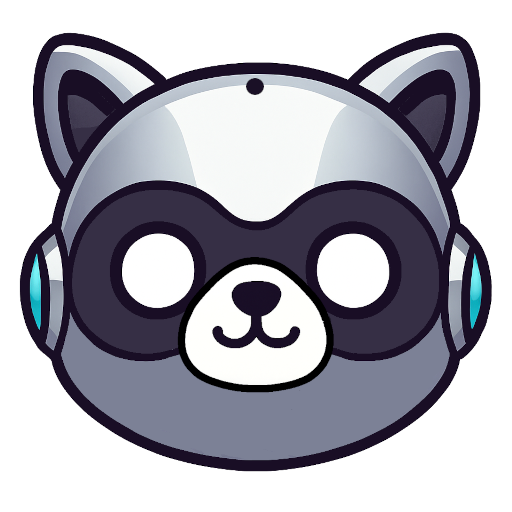

<p align="center">
  
</p>

<h1 align="center">BANDBIT</h1>

<blockquote>
  <p align="center">A Raccoon-Themed, Racket-Based Discord Bot.</p>
</blockquote>


---

> **STATUS:**
Currently I'm working on a pre-release version of [Cordian](https://github.com/megalisp/cordian) that this bot will be ported to. Which will act as a middleware bot-api kind of thing between bandbit and racket-cord which is super low-level (basically, mostly http endpoints).
---

---

---

> 🤖 + 🦝 = 

[Bandbit](https://megalisp.github.io/bandbit) is the personal Discord bot for [Megalisp](https://github.com/megalisp) and their community [The Megaplex]() and related communities / projects.  
Use at your own risk — we’re raccoon-dogfooding it, building it primarily to suit our own needs and wants.
 Not really intended for wide / general use (at least at this point in time).


---

## ⚡ Features

Command         | Description
----------------|------------------------------------------
 `or` 🦝echo [...]     | Echoes back your message
 `or`🦝ping           | Replies with "Pong!"
 `or`🦝server         | Shows the server name and ID
 `or`🦝help           | Lists available commands
 `or`🦝avatar         | Shows your profile picture URL
 `or`🦝say [...]      | Deletes your message and reposts it as the bot
 `or`🦝reverse [...]  | Reverses your message text

---

## 🦾 Getting Started

1.  **Install Racket (8.7 or later recommended):**

>   https://racket-lang.org

2. **Clone the repo:**
```
   git clone https://github.com/megalisp/bandbit
   cd bandbit
```

3. **Install dependencies:**
```
   raco pkg install --auto
```

4. **Set your bot token (use a .env loader or export manually):**
```
   export BOT_TOKEN="your_discord_bot_token"
```

5. **Run the bot:**
```
   racket main.rkt
```

---

## 🔧 Environment Variables

Variable    | Description
------------|--------------------------
BOT_TOKEN   | Your Discord bot token

---

## 🗺️ Roadmap
> These aren't really a roadmap, in that I have no real specific plan ... but, these are things I more-or-less want so a grab-bag of features I'm interested in implementing "eventually" in some real loose order.

That being said,

<details>
<summary>Role checks / permissions</summary>
<p>
Start by implementing user role validation to restrict command usage based on Discord roles. This provides essential control for admin-level and sensitive features.
</p>
</details>

<details>
<summary>Logging and analytics for command usage</summary>
<p>
Track command usage and errors. This helps with debugging, feature planning, and understanding how the bot is used across servers.
</p>
</details>

<details>
<summary>Persistent user and configuration storage</summary>
<p>
Store server-wide settings and state persistently across bot restarts using files or a database backend. Enables features like saved roles or command preferences.
</p>
</details>

<details>
<summary>Modular plugin system</summary>
<p>
Refactor commands into independent modules. This allows hot-reloading, optional features, and cleaner long-term architecture.
</p>
</details>

<details>
<summary>Scheduled tasks and reminders</summary>
<p>
Allow users to schedule timed events and reminders within the server, like daily pings, countdowns, or temporary role applications.
</p>
</details>

<details>
<summary>Auto-moderation and spam detection</summary>
<p>
Add basic automatic moderation features such as anti-spam filters, banned word detection, or mass ping throttling.
</p>
</details>

<details>
<summary>Integration with external APIs and services</summary>
<p>
Extend bot features by connecting to outside services like weather, feeds, or custom APIs. Great for pulling in dynamic or community-specific data.
</p>
</details>

<details>
<summary>Dynamic status / activity messages</summary>
<p>
Enable the bot to cycle through various statuses (e.g., help prompt, server stats, funny messages) to keep presence engaging and informative.
</p>
</details>

<details>
<summary>Racket-based management GUI</summary>
<p>
Build a local GUI using Racket’s GUI toolkit to manage the bot’s configuration, view logs, test commands, and monitor runtime state.
</p>
</details>


---

## 📜 License

Dual-Licensed Under MIT x Apache-2.0

---

## 💡 Acknowledgments

- Powered by the great [racket-cord](https://docs.racket-lang.org/racket-cord/index.html)
